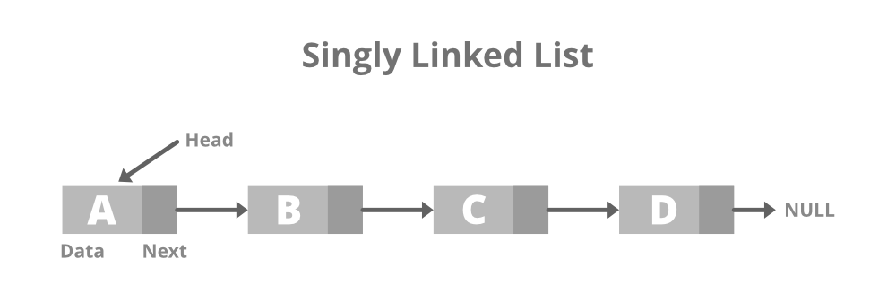

# Linked List

Created: September 20, 2021 11:23 AM

- It is a Linear Data Structure.
- It in a nutshell is multiple blocks of memory linked to each other.

### Advantages →

- Size can be modified.
- Memory is non-contiguous.
- Insertion and deletion at any point is easier.

### Structure →

- Singly Linked List →

-
